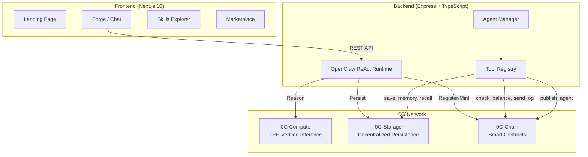

# NeuronForge 🧠⚡

> **OpenClaw-compatible agent infrastructure on 0G — Build, reason, persist, and tokenize autonomous AI agents.**

[](https://www.hackquest.io/hackathons/0G-APAC-Hackathon)
[](https://www.hackquest.io/hackathons/0G-APAC-Hackathon)
[](LICENSE)

## What is NeuronForge?

NeuronForge is an open-source **agent infrastructure platform** built on [0G Network](https://0g.ai). It implements a custom [OpenClaw](https://openclaw.ai)-compatible **ReAct (Reason + Act) runtime** that enables anyone to create autonomous AI agents with:

- **Decentralized reasoning** — LLM inference through 0G Compute (TEE-verified)
- **Persistent memory** — Agent state stored on 0G Decentralized Storage
- **On-chain identity** — Agents tokenized as INFTs (ERC-7857) on 0G Chain
- **Composable skills** — Modular tool system inspired by OpenClaw's architecture

## 0G Integration

NeuronForge deeply integrates **three layers** of the 0G stack:

| 0G Component | Integration | How It's Used |
|---|---|---|
| **0G Compute** | TEE-verified inference | All agent reasoning runs through decentralized LLM providers (DeepSeek V3, Qwen 2.5) |
| **0G Storage** | Persistent memory | Agent memory, conversation history, and state snapshots uploaded via SDK |
| **0G Chain** | Smart contracts | AgentRegistry for on-chain registration + NeuronForgeINFT (ERC-7857) for tokenization |

## Architecture



### ReAct Loop Flow

```
1. User sends message
2. System prompt assembled (persona + available tools)
3. LLM reasons via 0G Compute (TEE-verified)
4. If tool needed → execute tool → feed result back → repeat
5. Final answer returned with reasoning chain
6. Memory auto-persisted to 0G Storage
```

## Deployed Contracts

### 0G Mainnet

| Contract | Address | Explorer |
|---|---|---|
| **AgentRegistry** | `0x956Bc852B2242cF75939185aA58dA4ae165b6B4D` | [View →](https://chainscan.0g.ai/address/0x956Bc852B2242cF75939185aA58dA4ae165b6B4D) |
| **NeuronForgeINFT** | `0xEC301d01Cf816010A2f1c4f8ef05726405277fA9` | [View →](https://chainscan.0g.ai/address/0xEC301d01Cf816010A2f1c4f8ef05726405277fA9) |

### 0G Galileo Testnet

| Contract | Address | Explorer |
|---|---|---|
| **AgentRegistry** | `0x956Bc852B2242cF75939185aA58dA4ae165b6B4D` | [View →](https://chainscan-galileo.0g.ai/address/0x956Bc852B2242cF75939185aA58dA4ae165b6B4D) |
| **NeuronForgeINFT** | `0xEC301d01Cf816010A2f1c4f8ef05726405277fA9` | [View →](https://chainscan-galileo.0g.ai/address/0xEC301d01Cf816010A2f1c4f8ef05726405277fA9) |

## Custom OpenClaw Skills

| Skill | Description | 0G Component |
|---|---|---|
| `0g-inference` | Routes LLM reasoning through 0G Compute Network | 0G Compute |
| `0g-memory` | Persists agent memory to 0G Decentralized Storage | 0G Storage |
| `0g-wallet` | On-chain balance queries, transfers, and block info | 0G Chain |
| `0g-publish` | Packages & mints agents as INFTs on 0G Chain | 0G Chain |

## Built-in Agent Tools

| Tool | Function | 0G Integration |
|---|---|---|
| `check_balance` | Query wallet OG balance on-chain | 0G Chain RPC |
| `send_og` | Transfer OG tokens (max 0.01 safety limit) | 0G Chain TX |
| `get_block` | Fetch latest block info from 0G Chain | 0G Chain RPC |
| `get_transaction` | Look up transaction details by hash | 0G Chain RPC |
| `get_wallet_info` | Full wallet details (balance, nonce, chain) | 0G Chain RPC |
| `get_transactions` | Recent transaction history scan | 0G Chain RPC |
| `save_memory` | Persist conversation to 0G Storage | 0G Storage SDK |
| `recall_memory` | Search through stored conversation history | Local + 0G Storage |
| `publish_agent` | Package agent state and mint as INFT | 0G Storage + Chain |

## Quick Start

### Prerequisites
- Node.js >= 22.0.0
- Wallet with OG testnet tokens ([faucet](https://faucet.0g.ai))
- MetaMask or compatible Web3 wallet

### Setup

```bash
# Clone
git clone https://github.com/BrayoJunior/neuronforge.git
cd neuronforge

# Install all workspaces
npm install --prefix frontend
npm install --prefix backend
npm install --prefix contracts
npm install --prefix skills

# Configure
cp .env.example .env
# Edit .env — add your PRIVATE_KEY (wallet with OG testnet tokens)

# Deploy contracts to 0G Galileo Testnet
cd contracts && npx hardhat run scripts/deploy.js --network testnet
# Copy the output addresses to .env (AGENT_REGISTRY_ADDRESS, INFT_ADDRESS)

# Setup 0G Compute (requires ~4 OG for provider deposit)
cd ../backend && npm run setup:compute

# Start backend (port 3001)
npm run dev

# Start frontend (port 3000) — in another terminal
cd ../frontend && npm run dev
```

### Test Account

- **Wallet**: `0x3BD54CA06ea6C17806898F2b22bfd709DD7b4343`
- **Network**: 0G Galileo Testnet (Chain ID: 16602)
- **RPC**: `https://evmrpc-testnet.0g.ai`
- **Explorer**: [chainscan-galileo.0g.ai](https://chainscan-galileo.0g.ai)

## API Documentation

### Agents API

| Method | Endpoint | Description |
|---|---|---|
| `GET` | `/api/agents` | List all agents |
| `POST` | `/api/agents` | Create a new agent |
| `GET` | `/api/agents/:id` | Get agent details |
| `POST` | `/api/agents/:id/chat` | Chat with agent (runs ReAct loop) |
| `POST` | `/api/agents/:id/persist` | Persist memory to 0G Storage |
| `POST` | `/api/agents/:id/mint` | Mint agent as INFT (ERC-7857) |
| `GET` | `/api/agents/:id/tools` | List agent's registered tools |

### Skills API

| Method | Endpoint | Description |
|---|---|---|
| `GET` | `/api/skills` | List all available skills |
| `GET` | `/api/skills/:id` | Get skill details |
| `POST` | `/api/skills/publish` | Publish custom skill to 0G Storage |

### Marketplace API

| Method | Endpoint | Description |
|---|---|---|
| `GET` | `/api/marketplace` | List all marketplace listings |
| `POST` | `/api/marketplace/list` | List an agent INFT for sale |
| `POST` | `/api/marketplace/buy/:id` | Buy an agent INFT |

## Project Structure

```
neuronforge/
├── frontend/              # Next.js 16 (App Router)
│   └── src/app/
│       ├── page.tsx       # Landing page with particle bg + live chain stats
│       ├── forge/         # Agent builder + chat with ReAct visualization
│       ├── skills/        # Skill catalog with category filters
│       ├── marketplace/   # Agent marketplace with sorting
│       └── components/    # Navbar, ParticleBackground
├── backend/               # Express + TypeScript API
│   └── src/
│       ├── openclaw/      # ReAct runtime + types
│       ├── services/      # 0G Compute, Storage, Chain services
│       └── routes/        # Agent, Skills, Marketplace APIs
├── contracts/             # Solidity (Hardhat 3)
│   └── contracts/
│       ├── AgentRegistry.sol     # On-chain agent registry
│       └── NeuronForgeINFT.sol   # ERC-7857 INFT implementation
├── skills/                # OpenClaw-compatible skills
│   ├── 0g-inference/      # 0G Compute routing
│   ├── 0g-memory/         # 0G Storage persistence
│   ├── 0g-wallet/         # On-chain interactions
│   └── 0g-publish/        # INFT minting pipeline
└── .env.example           # Environment template
```

## Roadmap

- [x] OpenClaw-compatible ReAct runtime
- [x] 0G Compute integration (TEE-verified inference)
- [x] 0G Storage integration (persistent memory)
- [x] Smart contracts deployed (AgentRegistry + NeuronForgeINFT)
- [x] 4 custom OpenClaw skills
- [x] Agent builder UI with ReAct visualization
- [x] INFT minting (agent tokenization)
- [x] Real on-chain tool execution (send_og, check_balance, etc.)
- [x] Live 0G Chain stats on landing page
- [ ] INFT marketplace (on-chain listings + purchases)
- [ ] Multi-agent collaboration
- [ ] Agent fine-tuning via 0G Compute

## Tech Stack

- **Frontend**: Next.js 16, TypeScript, Vanilla CSS, Canvas API
- **Backend**: Express, TypeScript, tsx
- **Contracts**: Solidity 0.8.24, Hardhat 3
- **0G SDKs**: `@0gfoundation/0g-ts-sdk`, `@0glabs/0g-serving-broker`
- **Chain**: 0G Galileo Testnet (EVM-compatible)

## License

MIT
